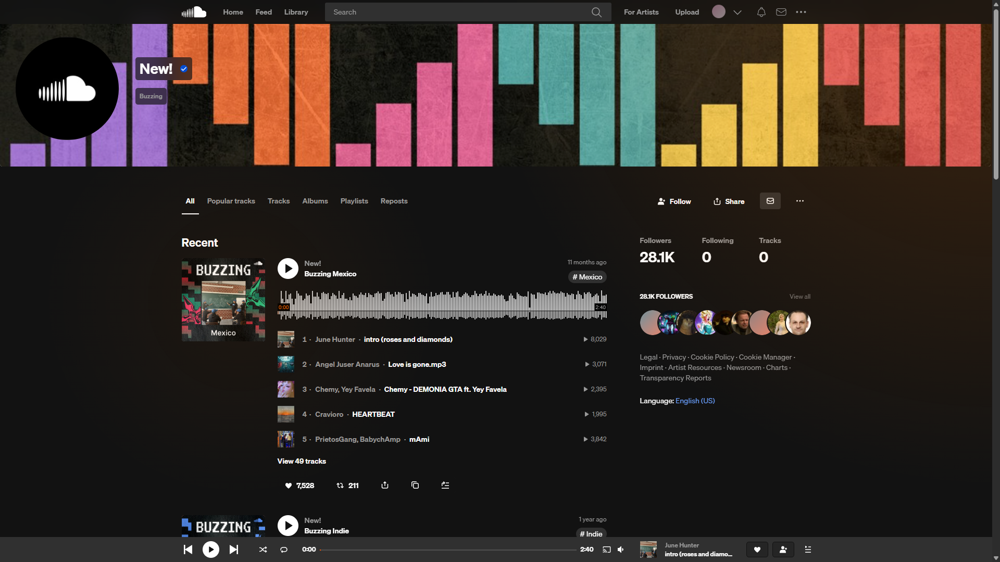
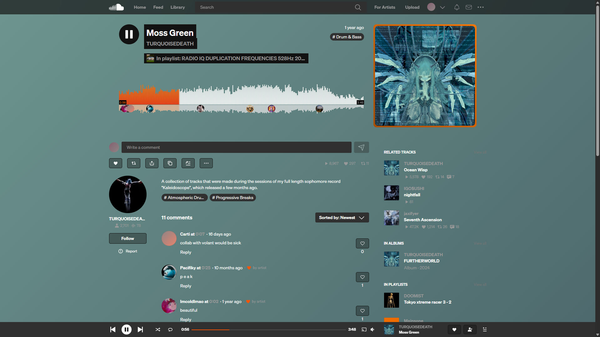

# Better Soundcloud Design

Improves Soundcloud's design by enhancing the default style, changing the style, and increasing the focus on a glassmorphism style with orange accents.

## Features

- **Dynamic Gradient Background**: Extracts and applies album/track artwork gradients as the page background
- **Glassmorphism UI**: Adds blur effects and translucent backgrounds to controls and headers
- **Orange Accent Theme**: Custom orange color scheme throughout the interface
- **Animated Background Elements**: Subtle animated gradient circles when no artwork is available
- **Profile Header Enhancement**: Redesigned profile pages with full-width header and improved spacing
- **Streamlined Interface**: Removes clutter (sidebar modules, mobile app banners, upsells)
- **Enhanced Buttons**: Styled like/share/repost buttons with hover effects
- **Improved Track Lists**: Hover animations and better visual hierarchy
- **Cross-browser Compatibility**: Works on Chrome, Firefox, Edge, Safari, Brave, and more

## Installation

### Option 1: Using Tampermonkey (Recommended)

1. Install the [Tampermonkey extension](https://www.tampermonkey.net/) for your browser.
2. [Install from Greasy Fork]() or create a new script and paste the contents of `script.js`.
3. Save the script and navigate to [Soundcloud](https://soundcloud.com).

### Option 2: Manual Installation

1. Install a userscript manager (Tampermonkey, Violentmonkey, or Greasemonkey).
2. Create a new script and copy the entire contents of `script.js`.
3. Save and visit [Soundcloud](https://soundcloud.com).

### Option 3: GitHub (Development Version)

1. Install a userscript manager.
2. Copy the raw content from the [latest release](https://github.com/anytngv2/Better-Soundcloud-Design/releases/latest).
3. Create a new script and paste the code.

## Usage

1. Install the script and visit [Soundcloud](https://soundcloud.com).
2. The design enhancements apply automatically to all pages.
3. Navigate to any track, playlist, or profile to see the glassmorphism effects.
4. The background gradient changes dynamically based on the current track artwork.

## Preview

|Profile|Music|
|-|-|
|||

## How It Works

The script monitors Soundcloud's DOM for artwork buffers and extracts their gradient backgrounds to apply them to the entire page. When no artwork is available, it falls back to a dark theme with animated orange gradient circles. All UI elements are enhanced with CSS backdrop filters for the glassmorphism effect.

## License

MIT License - see [LICENSE](LICENSE) file for details.
